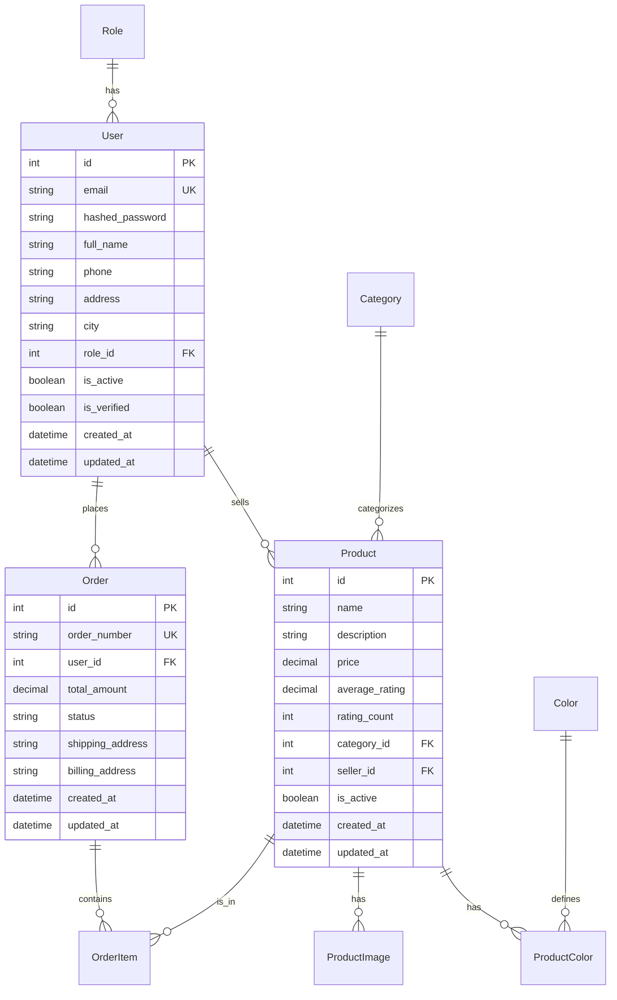

# Arquitectura del Sistema - Accessibility Things

## 📋 Índice
1. [Resumen Ejecutivo](#resumen-ejecutivo)
2. [Arquitectura General](#arquitectura-general)
3. [Backend - Patrones y Estructura](#backend---patrones-y-estructura)
4. [Frontend - Patrones y Estructura](#frontend---patrones-y-estructura)
5. [Patrones de Diseño Implementados](#patrones-de-diseño-implementados)
6. [Base de Datos y Persistencia](#base-de-datos-y-persistencia)
7. [Accesibilidad Web](#accesibilidad-web)
8. [Infraestructura y Despliegue](#infraestructura-y-despliegue)
9. [Recomendaciones de Mejora](#recomendaciones-de-mejora)

---

## 🎯 Resumen Ejecutivo

**Accessibility Things** es una aplicación de e-commerce especializada en productos de accesibilidad, desarrollada con una arquitectura de microservicios desacoplada que separa claramente el backend (API REST) del frontend (SPA estático). El sistema implementa patrones de diseño modernos, principios SOLID, y está optimizado para cumplir con las pautas de accesibilidad web WCAG 2.1/2.2.

### Características Arquitectónicas Clave:
- **Arquitectura**: Cliente-Servidor con API REST
- **Backend**: FastAPI (Python) con arquitectura en capas
- **Frontend**: SPA (Single Page Application) con JavaScript vanilla
- **Base de Datos**: PostgreSQL con migraciones Alembic
- **Accesibilidad**: Cumplimiento WCAG 2.1/2.2 AA
- **Containerización**: Docker Compose para desarrollo

---

## 🏗️ Arquitectura General

### Diagrama de Arquitectura de Alto Nivel

```
┌─────────────────┐    HTTP/JSON    ┌─────────────────┐    ORM/SQL    ┌─────────────────┐
│                 │    API REST     │                 │   Alembic     │                 │
│    Frontend     │ ◄─────────────► │    Backend      │ ◄───────────► │   PostgreSQL    │
│   (SPA Web)     │                 │   (FastAPI)     │               │   Database      │
│                 │                 │                 │               │                 │
└─────────────────┘                 └─────────────────┘               └─────────────────┘
        │                                   │                                   │
        │                                   │                                   │
        ▼                                   ▼                                   ▼
┌─────────────────┐                 ┌─────────────────┐               ┌─────────────────┐
│  Browser APIs   │                 │  Python Libs    │               │  Data Storage   │
│  - localStorage │                 │  - SQLAlchemy   │               │  - Tables       │
│  - sessionStorage│                 │  - Pydantic     │               │  - Indexes      │
│  - Fetch API    │                 │  - Passlib      │               │  - Constraints  │
└─────────────────┘                 └─────────────────┘               └─────────────────┘
```

### Principios Arquitectónicos Aplicados

1. **Separación de Responsabilidades**: Cliente y servidor completamente desacoplados
2. **Single Responsibility Principle**: Cada módulo tiene una única responsabilidad
3. **Open/Closed Principle**: Extensible sin modificar código existente
4. **Dependency Inversion**: Abstracciones no dependen de detalles
5. **Interface Segregation**: Interfaces específicas por dominio
6. **DRY (Don't Repeat Yourself)**: Reutilización de código y componentes

---

## 🔧 Backend - Patrones y Estructura

### Arquitectura en Capas (Layered Architecture)

El backend implementa una arquitectura en 5 capas bien definidas:

```
┌─────────────────────────────────────────────────────────────┐
│                    API Layer (Presentation)                 │
│  ┌─────────────┐ ┌─────────────┐ ┌─────────────┐           │
│  │   access.py │ │ products.py │ │ orders.py   │ ...       │
│  └─────────────┘ └─────────────┘ └─────────────┘           │
└─────────────────────────────────────────────────────────────┘
                             │
                             ▼
┌─────────────────────────────────────────────────────────────┐
│                   Service Layer (Business)                  │
│  ┌─────────────────┐ ┌─────────────────┐ ┌───────────────┐  │
│  │ access_service  │ │ product_service │ │ order_service │  │
│  └─────────────────┘ └─────────────────┘ └───────────────┘  │
└─────────────────────────────────────────────────────────────┘
                             │
                             ▼
┌─────────────────────────────────────────────────────────────┐
│                Repository Layer (Data Access)               │
│  ┌──────────────────┐ ┌─────────────────┐ ┌──────────────┐  │
│  │ access_repository│ │category_repository│ │role_repository│ │
│  └──────────────────┘ └─────────────────┘ └──────────────┘  │
└─────────────────────────────────────────────────────────────┘
                             │
                             ▼
┌─────────────────────────────────────────────────────────────┐
│                   Model Layer (Domain)                      │
│  ┌─────────┐ ┌─────────┐ ┌─────────┐ ┌─────────┐ ┌────────┐ │
│  │  User   │ │ Product │ │  Order  │ │Category │ │ Color  │ │
│  └─────────┘ └─────────┘ └─────────┘ └─────────┘ └────────┘ │
└─────────────────────────────────────────────────────────────┘
                             │
                             ▼
┌─────────────────────────────────────────────────────────────┐
│              Configuration & Infrastructure                  │
│  ┌─────────────┐ ┌─────────────┐ ┌─────────────┐           │
│  │ database.py │ │ settings.py │ │   main.py   │           │
│  └─────────────┘ └─────────────┘ └─────────────┘           │
└─────────────────────────────────────────────────────────────┘
```

### Patrones Implementados en Backend

#### 1. **Repository Pattern**
```python
# Ejemplo: category_repository.py
class CategoryRepository:
    def __init__(self, db: Session):
        self.db = db
    
    def get_all(self) -> List[Category]:
        return self.db.query(Category).all()
    
    def get_by_id(self, category_id: int) -> Optional[Category]:
        return self.db.query(Category).filter(Category.id == category_id).first()
    
    def create(self, category_data: CategoryCreate) -> Category:
        # Implementación de creación
```

**Ventajas**:
- Abstracción de la lógica de acceso a datos
- Facilita testing con mocks
- Centraliza operaciones CRUD
- Reutilización de consultas complejas

#### 2. **Service Layer Pattern**
```python
# Ejemplo: product_service.py
class ProductService:
    def __init__(self, db: Session):
        self.db = db
        self.category_repository = CategoryRepository(db)
        self.color_repository = ColorRepository(db)
    
    def get_products_paginated(self, filters) -> ProductListPaginatedResponse:
        # Lógica de negocio compleja
        # Validaciones, transformaciones, reglas de negocio
```

**Responsabilidades**:
- Lógica de negocio
- Validaciones complejas
- Coordinación entre repositorios
- Transformación de datos

#### 3. **Dependency Injection Pattern**
```python
# FastAPI maneja la inyección automáticamente
@router.post("/", response_model=ProductResponse)
def create_product(
    product: ProductCreate,
    db: Session = Depends(get_db)  # ⬅ Inyección de dependencia
):
    service = ProductService(db)
    return service.create_product(product)
```

#### 4. **Data Transfer Object (DTO) Pattern**
```python
# Schemas/DTOs para validación y serialización
class ProductCreate(BaseModel):
    name: str
    description: Optional[str] = None
    price: Decimal
    category_id: int
    seller_id: int

class ProductResponse(BaseModel):
    id: int
    name: str
    price: Decimal
    average_rating: Decimal
    # ... otros campos
```

#### 5. **Authentication & Authorization Pattern**
```python
# JWT + Bearer Token implementation
class AccessService:
    def create_access_token(self, data: dict) -> str:
        # Generación de JWT tokens
    
    def verify_token(self, token: str) -> Optional[str]:
        # Verificación de tokens
    
    def authenticate_user(self, email: str, password: str):
        # Autenticación de usuarios
```

### Estructura de Directorios Backend

```
backend/
├── app/
│   ├── __init__.py
│   ├── main.py                 # Configuración FastAPI y rutas principales
│   ├── api/                    # Endpoints REST (Presentation Layer)
│   │   ├── __init__.py
│   │   ├── access.py          # Autenticación y autorización
│   │   ├── products.py        # CRUD de productos
│   │   ├── categories.py      # Gestión de categorías
│   │   ├── orders.py          # Procesamiento de órdenes
│   │   ├── colors.py          # Gestión de colores
│   │   └── roles.py           # Gestión de roles
│   ├── services/              # Lógica de negocio (Business Layer)
│   │   ├── __init__.py
│   │   ├── access_service.py  # Autenticación, JWT, passwords
│   │   ├── product_service.py # Lógica de productos y filtros
│   │   ├── category_service.py# Gestión de categorías
│   │   ├── order_service.py   # Procesamiento de órdenes
│   │   ├── color_service.py   # Gestión de colores
│   │   └── role_service.py    # Gestión de roles de usuario
│   ├── repositories/          # Acceso a datos (Data Access Layer)
│   │   ├── __init__.py
│   │   ├── access_repository.py
│   │   ├── category_repository.py
│   │   ├── color_repository.py
│   │   └── role_repository.py
│   ├── models/                # Modelos de dominio (Domain Layer)
│   │   ├── __init__.py
│   │   ├── user.py           # Modelo de usuario con relaciones
│   │   ├── product.py        # Modelo de producto
│   │   ├── category.py       # Modelo de categoría
│   │   ├── color.py          # Modelo de color
│   │   ├── order.py          # Modelo de orden
│   │   ├── order_item.py     # Ítem de orden
│   │   ├── product_color.py  # Relación producto-color
│   │   ├── product_image.py  # Imágenes de productos
│   │   └── role.py           # Roles de usuario
│   ├── schemas/               # DTOs y validación (Data Transfer Objects)
│   │   ├── __init__.py
│   │   ├── user.py           # Esquemas de usuario (Create, Update, Response)
│   │   ├── product.py        # Esquemas de producto
│   │   ├── category.py       # Esquemas de categoría
│   │   ├── order.py          # Esquemas de orden
│   │   └── [otros schemas]
│   └── config/               # Configuración (Infrastructure Layer)
│       ├── __init__.py
│       ├── database.py       # Configuración SQLAlchemy
│       └── settings.py       # Variables de entorno
├── alembic/                  # Migraciones de base de datos
│   ├── env.py
│   ├── script.py.mako
│   └── versions/
├── requirements.txt          # Dependencias Python
├── Dockerfile               # Configuración Docker
└── alembic.ini             # Configuración Alembic
```

---

## 🌐 Frontend - Patrones y Estructura

### Arquitectura de Módulos (Module Pattern)

El frontend implementa una arquitectura basada en módulos especializados con responsabilidades específicas:

```
┌─────────────────────────────────────────────────────────────┐
│                   Presentation Layer                        │
│  ┌─────────────┐ ┌─────────────┐ ┌─────────────┐           │
│  │   HTML      │ │     CSS     │ │ Templates   │           │
│  │  Semantic   │ │ Accessible  │ │  Dynamic    │           │
│  └─────────────┘ └─────────────┘ └─────────────┘           │
└─────────────────────────────────────────────────────────────┘
                             │
                             ▼
┌─────────────────────────────────────────────────────────────┐
│                  UI Controller Layer                        │
│  ┌─────────────────────────────────────────────────────────┐ │
│  │              UIController Class                         │ │
│  │  • Page initialization    • Event handling             │ │
│  │  • DOM manipulation      • User interactions           │ │
│  │  • Component rendering   • Accessibility management    │ │
│  └─────────────────────────────────────────────────────────┘ │
└─────────────────────────────────────────────────────────────┘
                             │
                             ▼
┌─────────────────────────────────────────────────────────────┐
│                 Data Management Layer                       │
│  ┌─────────────────────────────────────────────────────────┐ │
│  │           DataManagerOptimized Class                    │ │
│  │  • Backend integration   • Local data management       │ │
│  │  • Cart management      • User session handling       │ │
│  │  • Cache management     • State synchronization       │ │
│  └─────────────────────────────────────────────────────────┘ │
└─────────────────────────────────────────────────────────────┘
                             │
                             ▼
┌─────────────────────────────────────────────────────────────┐
│                 API Communication Layer                     │
│  ┌─────────────────────────────────────────────────────────┐ │
│  │                ApiService Class                         │ │
│  │  • HTTP communication    • Authentication handling     │ │
│  │  • Request/Response      • Error handling              │ │
│  │  • JWT token management  • API versioning              │ │
│  └─────────────────────────────────────────────────────────┘ │
└─────────────────────────────────────────────────────────────┘
                             │
                             ▼
┌─────────────────────────────────────────────────────────────┐
│                  Accessibility Layer                        │
│  ┌─────────────────────────────────────────────────────────┐ │
│  │            Accessibility Controls                       │ │
│  │  • High contrast mode    • Font size adjustment        │ │
│  │  • Keyboard navigation   • Screen reader support       │ │
│  │  • ARIA attributes       • WCAG compliance             │ │
│  └─────────────────────────────────────────────────────────┘ │
└─────────────────────────────────────────────────────────────┘
```

### Patrones Implementados en Frontend

#### 1. **Module Pattern & Singleton**
```javascript
// DataManagerOptimized implementa Singleton
class DataManagerOptimized {
    constructor() {
        if (DataManagerOptimized.instance) {
            return DataManagerOptimized.instance;
        }
        // Inicialización única
        this.localData = { carrito: [], currentUser: null };
        this.backendData = { productos: [], categorias: [] };
        DataManagerOptimized.instance = this;
    }
}

// Instancia global única
const dataManagerOptimized = new DataManagerOptimized();
```

#### 2. **Observer Pattern (Event-Driven)**
```javascript
// UIController observa cambios en el carrito
class UIController {
    updateCartCounter() {
        // Observer que reacciona a cambios en el carrito
        const cartBadge = document.querySelector('.cart-badge');
        if (cartBadge) {
            const count = this.dataManager.getCartItemCount();
            cartBadge.textContent = count;
        }
    }
    
    // Event listeners como observers
    setupCartEvents() {
        document.addEventListener('cartUpdated', () => {
            this.updateCartCounter();
            this.displayCart();
        });
    }
}
```

#### 3. **Strategy Pattern (Multiple Data Sources)**
```javascript
// DataManagerOptimized maneja múltiples estrategias de datos
class DataManagerOptimized {
    constructor() {
        // Estrategia: Backend como fuente de verdad
        this.backendData = { productos: [], categorias: [] };
        // Estrategia: LocalStorage para datos persistentes del cliente
        this.localData = { carrito: [], currentUser: null };
    }
    
    async getProductos(filters = {}) {
        // Estrategia: Siempre desde backend para productos
        return this.backendData.productos;
    }
    
    addToCart(productId, quantity) {
        // Estrategia: LocalStorage para carrito
        // Lógica de carrito local
        this.saveCartToStorage();
    }
}
```

#### 4. **Factory Pattern (API Service)**
```javascript
// ApiService actúa como factory para requests HTTP
class ApiService {
    async makeRequest(url, options = {}) {
        // Factory method para crear requests configurados
        const config = {
            headers: this.getAuthHeaders(),
            ...options
        };
        return fetch(url, config);
    }
    
    // Factory methods específicos
    async get(url) { return this.makeRequest(url, { method: 'GET' }); }
    async post(url, data) { return this.makeRequest(url, { method: 'POST', body: JSON.stringify(data) }); }
    async put(url, data) { return this.makeRequest(url, { method: 'PUT', body: JSON.stringify(data) }); }
}
```

#### 5. **Template Method Pattern (Page Initialization)**
```javascript
class UIController {
    // Template method que define el algoritmo de inicialización
    async init() {
        await this.waitForDataManager();
        await this.waitForData();
        this.initializePage(); // Método que varía según la página
    }
    
    // Métodos específicos por página (implementaciones del template)
    initializeHomePage() { /* implementación específica */ }
    initializeCatalogPage() { /* implementación específica */ }
    initializeCartPage() { /* implementación específica */ }
}
```

#### 6. **Command Pattern (User Actions)**
```javascript
// Cada acción del usuario encapsulada como comando
class CartCommands {
    static addToCart(productId, quantity) {
        return {
            execute: () => dataManager.addToCart(productId, quantity),
            undo: () => dataManager.removeFromCart(productId)
        };
    }
    
    static updateQuantity(productId, newQuantity) {
        return {
            execute: () => dataManager.updateCartQuantity(productId, newQuantity),
            undo: () => dataManager.updateCartQuantity(productId, oldQuantity)
        };
    }
}
```

### Estructura de Directorios Frontend

```
frontend/
├── index.html              # Página principal
├── catalogo.html          # Página de catálogo de productos
├── carrito.html           # Página de carrito de compras
├── detalle.html           # Página de detalle de producto
├── checkout.html          # Página de proceso de compra
├── perfil.html            # Página de perfil de usuario
├── login.html             # Página de autenticación
├── register.html          # Página de registro
├── orden-completada.html  # Confirmación de orden
├── orderDetail.html       # Detalle de orden específica
├── css/                   # Estilos CSS
│   ├── main.css          # Estilos principales
│   └── accessibility.css # Estilos de accesibilidad
├── js/                    # JavaScript modules
│   ├── main.js           # Orquestador principal (Template Method)
│   ├── api-service.js    # Comunicación HTTP (Factory Pattern)
│   ├── data-manager-optimized.js  # Gestión de datos (Singleton + Strategy)
│   ├── ui-controller.js  # Control de UI (Observer + Command)
│   ├── accessibility.js  # Controles de accesibilidad
│   └── data-manager.js   # Gestor de datos legacy (deprecated)
├── images/               # Imágenes de productos
├── assets/              # Recursos estáticos adicionales
└── tests/               # Pruebas del frontend
    ├── accessibility/   # Tests de accesibilidad
    ├── ui/             # Tests de interfaz de usuario
    └── unit/           # Tests unitarios
```

---

## 🎨 Patrones de Diseño Implementados

### Patrones Estructurales

#### 1. **Layered Architecture (Backend)**
- **API Layer**: Endpoints REST con FastAPI
- **Service Layer**: Lógica de negocio
- **Repository Layer**: Acceso a datos
- **Model Layer**: Modelos de dominio
- **Infrastructure Layer**: Configuración y utilidades

#### 2. **Model-View-Controller (MVC) Adaptado (Frontend)**
- **Model**: DataManagerOptimized + ApiService
- **View**: HTML templates + CSS
- **Controller**: UIController + event handlers

### Patrones Creacionales

#### 1. **Singleton Pattern**
```javascript
// DataManagerOptimized y ApiService son singletons
const dataManagerOptimized = new DataManagerOptimized();
const apiService = new ApiService();
```

#### 2. **Factory Pattern**
```python
# Repository factory en servicios
class ProductService:
    def __init__(self, db: Session):
        self.category_repository = CategoryRepository(db)  # Factory
        self.color_repository = ColorRepository(db)        # Factory
```

### Patrones Comportamentales

#### 1. **Observer Pattern**
```javascript
// Event-driven updates en el frontend
document.addEventListener('cartUpdated', updateUI);
document.addEventListener('userLoggedIn', updateAuthState);
```

#### 2. **Strategy Pattern**
```javascript
// Múltiples estrategias de almacenamiento
class DataManagerOptimized {
    // Backend strategy para productos
    async getProductos() { return this.backendData.productos; }
    
    // LocalStorage strategy para carrito
    getCart() { return this.localData.carrito; }
}
```

#### 3. **Template Method Pattern**
```javascript
// Algoritmo de inicialización con pasos variables
class UIController {
    async init() {
        await this.waitForDataManager();  // Común
        await this.waitForData();         // Común
        this.initializePage();            // Variable por página
    }
}
```

#### 4. **Command Pattern**
```python
# Operaciones encapsuladas en servicios
class AccessService:
    def register_user_with_token(self, user_data):
        # Comando compuesto: crear usuario + generar token
        user = self.register_user(user_data)
        token = self.create_access_token({"sub": user.email})
        return {"user": user, "access_token": token}
```

### Patrones de Accesibilidad

#### 1. **Progressive Enhancement**
```javascript
// Funcionalidad básica HTML + mejoras JavaScript
function initializeAccessibilityControls() {
    // Solo mejora si JavaScript está disponible
    if (document.getElementById('high-contrast-toggle')) {
        // Mejoras de accesibilidad dinámicas
    }
}
```

#### 2. **Graceful Degradation**
```css
/* Estilos base accesibles + mejoras opcionales */
.button {
    /* Estilos base */
    color: var(--color-texto);
    background: var(--color-fondo);
}

@media (prefers-reduced-motion: no-preference) {
    .button {
        /* Animaciones solo si el usuario las permite */
        transition: all 0.3s ease;
    }
}
```

---

## 🗄️ Base de Datos y Persistencia

### Modelo de Datos



### Patrones de Persistencia

#### 1. **Unit of Work Pattern**
```python
# SQLAlchemy maneja automáticamente el Unit of Work
def create_product(product_data):
    db_product = Product(**product_data.dict())
    db.add(db_product)         # Tracked by UoW
    db.commit()               # UoW commits all changes
    db.refresh(db_product)    # Sync with DB
    return db_product
```

#### 2. **Active Record Pattern (con SQLAlchemy ORM)**
```python
class Product(Base):
    __tablename__ = "products"
    
    # Los modelos encapsulan tanto datos como comportamiento
    def update_rating(self, new_rating):
        # Lógica de negocio en el modelo
        self.rating_count += 1
        total_rating = (self.average_rating * (self.rating_count - 1)) + new_rating
        self.average_rating = total_rating / self.rating_count
```

#### 3. **Migration Pattern (Alembic)**
```python
# Migraciones versionadas para evolución del esquema
# versions/20230720_add_rating_count_to_products.py
def upgrade():
    op.add_column('products', sa.Column('rating_count', sa.Integer(), default=0))

def downgrade():
    op.drop_column('products', 'rating_count')
```

### Estrategias de Caché

#### Frontend (Navegador)
```javascript
class DataManagerOptimized {
    constructor() {
        // Cache en memoria para datos del backend
        this.backendData = { productos: [], categorias: [] };
        
        // Persistencia local para datos del usuario
        this.localData = { carrito: [], currentUser: null };
    }
    
    async loadFromBackend() {
        // Cache con TTL implícito (refresh en cada sesión)
        this.backendData.productos = await this.apiService.getProducts();
        this.backendData.categorias = await this.apiService.getCategories();
    }
}
```

#### Backend (Database)
```python
# PostgreSQL con índices optimizados
class Product(Base):
    id = Column(Integer, primary_key=True, index=True)  # B-tree index
    name = Column(String, index=True)                   # Search index
    category_id = Column(Integer, ForeignKey("categories.id"), index=True)  # Join index
```

---

## ♿ Accesibilidad Web

### Implementación WCAG 2.1/2.2

#### Nivel AA Compliance

##### 1. **Perceptible**
```css
/* Contraste mínimo 4.5:1 para texto normal */
:root {
    --color-texto: #1a202c;       /* Ratio 16.68:1 */
    --color-fondo: #ffffff;       /* Ratio 21:1 */
    --color-acento: #2b6cb0;      /* Ratio 4.89:1 */
}

/* Contraste alto disponible */
.high-contrast {
    --color-texto: #000000;
    --color-fondo: #ffffff;
    --color-acento: #0000ff;
}
```

##### 2. **Operable**
```javascript
// Navegación por teclado
function initializeKeyboardNavigation() {
    document.addEventListener('keydown', function(e) {
        // Tab navigation
        if (e.key === 'Tab') {
            document.body.classList.add('keyboard-navigation');
        }
        
        // Skip links
        if (e.key === 'Enter' && e.target.classList.contains('skip-link')) {
            const target = document.querySelector(e.target.getAttribute('href'));
            target?.focus();
        }
    });
}
```

##### 3. **Comprensible**
```html
<!-- Estructura semántica clara -->
<main role="main" aria-labelledby="main-heading">
    <h1 id="main-heading">Catálogo de Productos</h1>
    
    <nav role="navigation" aria-label="Filtros de búsqueda">
        <form role="search">
            <label for="search-input">Buscar productos</label>
            <input type="search" id="search-input" aria-describedby="search-help">
            <div id="search-help" class="sr-only">
                Busque por nombre o descripción del producto
            </div>
        </form>
    </nav>
    
    <section aria-label="Resultados de productos">
        <!-- Productos con estructura semántica -->
    </section>
</main>
```

##### 4. **Robusto**
```javascript
// Compatible con tecnologías asistivas
function announceToScreenReader(message) {
    const announcement = document.createElement('div');
    announcement.setAttribute('aria-live', 'polite');
    announcement.setAttribute('aria-atomic', 'true');
    announcement.className = 'sr-only';
    announcement.textContent = message;
    
    document.body.appendChild(announcement);
    
    setTimeout(() => {
        document.body.removeChild(announcement);
    }, 1000);
}
```

### Características de Accesibilidad Implementadas

#### 1. **Controles de Usuario**
- **Alto Contraste**: Toggle para modo de alto contraste
- **Tamaño de Fuente**: Ajuste dinámico (pequeña, normal, grande)
- **Navegación por Teclado**: Completa navegabilidad sin mouse
- **Atajos de Teclado**: Shortcuts para funciones principales

#### 2. **ARIA y Semántica**
```html
<!-- Ejemplos de ARIA implementation -->
<button aria-expanded="false" aria-controls="menu-dropdown" aria-haspopup="true">
    Menú
</button>

<div id="menu-dropdown" role="menu" aria-labelledby="menu-button">
    <a href="#" role="menuitem">Opción 1</a>
    <a href="#" role="menuitem">Opción 2</a>
</div>

<div role="status" aria-live="polite" aria-atomic="true">
    <!-- Mensajes dinámicos para lectores de pantalla -->
</div>
```

#### 3. **Responsive y Adaptativo**
```css
/* Diseño adaptativo para diferentes necesidades */
@media (max-width: 768px) {
    .product-grid { grid-template-columns: 1fr; }
}

@media (prefers-reduced-motion: reduce) {
    * { transition: none !important; }
}

@media (prefers-color-scheme: dark) {
    /* Modo oscuro automático */
}
```

---

## 🚀 Infraestructura y Despliegue

### Containerización con Docker

#### Backend Container
```dockerfile
# backend/Dockerfile
FROM python:3.9-slim

WORKDIR /app

COPY requirements.txt .
RUN pip install --no-cache-dir -r requirements.txt

COPY . .

CMD ["uvicorn", "app.main:app", "--host", "0.0.0.0", "--port", "8000", "--reload"]
```

#### Docker Compose Orchestration
```yaml
# docker-compose.yml
services:
  backend:
    build: ./backend
    ports: ["8000:8000"]
    environment:
      - DATABASE_URL=postgresql://${POSTGRES_USER}:${POSTGRES_PASSWORD}@db:5432/${POSTGRES_DB}
    depends_on: [db]
    
  db:
    image: postgres:14-alpine
    ports: ["5432:5432"]
    volumes: [postgres_data:/var/lib/postgresql/data]
    environment:
      - POSTGRES_DB=${POSTGRES_DB}
      - POSTGRES_USER=${POSTGRES_USER}
      - POSTGRES_PASSWORD=${POSTGRES_PASSWORD}

volumes:
  postgres_data:
```

### Configuración de Entorno

#### Environment Configuration
```python
# backend/app/config/settings.py
class Settings(BaseSettings):
    # Database
    database_url: str = Field(..., env="DATABASE_URL")
    
    # JWT Security
    secret_key: str = "your-super-secret-key-change-this-in-production"
    algorithm: str = "HS256"
    access_token_expire_minutes: int = 30
    
    # Email Configuration
    smtp_server: Optional[str] = None
    smtp_port: int = 587
    
    class Config:
        env_file = ".env"
        extra = "forbid"
```

### Database Migrations
```bash
# Comandos de migración
alembic init alembic                    # Inicializar migraciones
alembic revision --autogenerate -m "descripción"  # Crear migración
alembic upgrade head                    # Aplicar migraciones
alembic downgrade -1                    # Revertir migración
```

---

## 📊 Recomendaciones de Mejora

### 1. **Arquitectura Backend**

#### Implementaciones Recomendadas
- **CQRS Pattern**: Separar comandos de consultas para mejor performance
- **Event Sourcing**: Para auditoría completa de cambios
- **Cache Layer**: Redis para cache distribuido
- **Message Queue**: Para procesamiento asíncrono (ej: emails, notificaciones)

```python
# Ejemplo CQRS implementation
class ProductCommandService:
    def create_product(self, command: CreateProductCommand):
        # Handle writes
        pass

class ProductQueryService:
    def get_products_paginated(self, query: GetProductsQuery):
        # Handle reads with optimized queries
        pass
```

#### Mejoras de Seguridad
- **Rate Limiting**: Throttling de requests por IP/usuario
- **Input Validation**: Validación más robusta con Pydantic
- **HTTPS Enforcement**: Certificados SSL/TLS
- **Database Security**: Prepared statements, row-level security

### 2. **Arquitectura Frontend**

#### Estado y Performance
- **State Management**: Implementar Flux/Redux pattern para estado complejo
- **Code Splitting**: Lazy loading de módulos por página
- **Service Worker**: Para cache offline y mejor performance
- **Web Components**: Componentización con Custom Elements

```javascript
// Ejemplo State Management pattern
class StateManager {
    constructor() {
        this.state = {
            products: [],
            cart: [],
            user: null,
            ui: { loading: false, errors: [] }
        };
        this.listeners = [];
    }
    
    dispatch(action) {
        this.state = this.reducer(this.state, action);
        this.notifyListeners();
    }
    
    subscribe(listener) {
        this.listeners.push(listener);
    }
}
```

#### Accesibilidad Avanzada
- **Screen Reader Testing**: Pruebas automatizadas con herramientas como aXe
- **Voice Navigation**: Soporte para navegación por voz
- **Keyboard Shortcuts**: Sistema completo de atajos configurables
- **Focus Management**: Gestión avanzada del foco en SPAs

### 3. **DevOps y Deployment**

#### CI/CD Pipeline
```yaml
# .github/workflows/deploy.yml
name: Deploy
on:
  push:
    branches: [main]

jobs:
  test:
    runs-on: ubuntu-latest
    steps:
      - uses: actions/checkout@v2
      - name: Run Backend Tests
        run: pytest backend/tests/
      - name: Run Frontend Tests  
        run: npm test frontend/
      - name: Accessibility Tests
        run: npm run test:a11y

  deploy:
    needs: test
    runs-on: ubuntu-latest
    steps:
      - name: Deploy to Production
        run: docker-compose -f docker-compose.prod.yml up -d
```

#### Monitoring y Observabilidad
- **Application Monitoring**: Métricas de performance y errores
- **Database Monitoring**: Query performance y uso de recursos
- **User Experience Monitoring**: Métricas de accesibilidad real
- **Logging**: Structured logging con correlación de requests

### 4. **Testing Strategy**

#### Backend Testing
```python
# tests/test_product_service.py
import pytest
from app.services.product_service import ProductService

class TestProductService:
    def test_get_products_paginated(self, db_session):
        service = ProductService(db_session)
        result = service.get_products_paginated(page=1, limit=10)
        assert result.total_count >= 0
        assert len(result.products) <= 10
```

#### Frontend Testing
```javascript
// tests/ui/test_cart.js
describe('Cart Functionality', () => {
    test('should add product to cart', async () => {
        const dataManager = new DataManagerOptimized();
        dataManager.addToCart(1, 2);
        
        const cart = dataManager.getCart();
        expect(cart).toContainEqual({
            productId: 1,
            quantity: 2
        });
    });
});
```

#### Accessibility Testing
```javascript
// tests/accessibility/test_a11y.js
import { axeCheck } from '@axe-core/playwright';

test('catalog page should be accessible', async ({ page }) => {
    await page.goto('/catalogo.html');
    const results = await axeCheck(page);
    expect(results.violations).toHaveLength(0);
});
```

### 5. **Performance Optimizations**

#### Backend Optimizations
- **Database Indexing**: Índices optimizados para queries frecuentes
- **Query Optimization**: N+1 problem resolution con eager loading
- **Response Compression**: Gzip/Brotli compression
- **Connection Pooling**: Optimización de conexiones DB

#### Frontend Optimizations  
- **Image Optimization**: WebP, lazy loading, responsive images
- **Bundle Optimization**: Tree shaking, minification
- **Critical CSS**: Above-the-fold CSS inlining
- **Resource Hints**: Preload, prefetch para recursos críticos

---

## 📈 Métricas y KPIs

### Métricas de Performance
- **Backend**: Response time < 200ms para 95% de requests
- **Frontend**: First Contentful Paint < 1.5s
- **Database**: Query execution < 100ms promedio

### Métricas de Accesibilidad
- **WCAG Compliance**: 100% AA compliance
- **Lighthouse Accessibility Score**: > 95
- **Screen Reader Compatibility**: Testeo con NVDA, JAWS, VoiceOver

### Métricas de Usuario
- **Task Completion Rate**: > 90% para flujos críticos
- **Error Rate**: < 1% para operaciones principales
- **User Satisfaction**: Métricas de usabilidad para usuarios con discapacidades

---

## 📚 Conclusiones

El sistema **Accessibility Things** implementa una arquitectura sólida y moderna que:

1. **Separa correctamente las responsabilidades** entre frontend y backend
2. **Implementa patrones de diseño probados** para mantenibilidad y escalabilidad  
3. **Prioriza la accesibilidad** como requerimiento fundamental, no como añadido
4. **Utiliza tecnologías modernas** con FastAPI, PostgreSQL y JavaScript ES6+
5. **Facilita el testing** con arquitectura testeable y separación de capas
6. **Permite evolución futura** con patrones extensibles y código desacoplado

### Fortalezas Principales
- ✅ Arquitectura en capas bien definida
- ✅ Patrones de diseño apropiados
- ✅ Cumplimiento WCAG 2.1/2.2 AA
- ✅ Separación clara de responsabilidades
- ✅ API REST bien diseñada
- ✅ Frontend accesible y usable

### Áreas de Oportunidad
- 🔄 Implementar cache distribuido (Redis)
- 🔄 Añadir testing automatizado completo
- 🔄 Mejorar observabilidad y monitoring
- 🔄 Implementar CI/CD robusto
- 🔄 Optimizar performance frontend
- 🔄 Añadir autenticación OAuth2/OpenID Connect

Esta arquitectura proporciona una base sólida para el crecimiento y evolución del sistema, manteniendo siempre la accesibilidad como principio fundamental del diseño.
